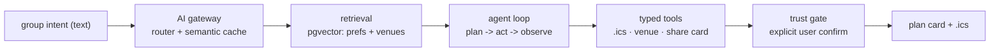

# Boja (보자)

**Boja (보자 — "let's hang out") — the AI concierge that turns it into a real plan.**
React Native · Swift / StoreKit 2 · Node.js / TypeScript

> 30-second demo — *ships with Story 01.*

## Why this exists

I've met many people who started as good companions but passed by as strangers quite quickly. Boja is my answer to that — a way to overcome loneliness in crowds, and all the meaningless, empty promises in social media DMs. I'm building it for myself first.

The name is plain Korean: 언제 한번 보자, "let's hang out sometime." This product exists to turn that one sentence into a plan that actually happens.

## What it does — MVP (Story 01)

You paste a group intent — "dinner next week with A and B." Boja proposes three time-and-venue options from your saved preferences and venue notes; you confirm one; it produces a shareable plan card plus a `.ics` calendar file. Nothing is sent to anyone automatically — confirmation stays with you. That is a deliberate trust boundary, not a missing feature.

## Architecture

Monorepo — pnpm workspaces + Turborepo. Four workspaces, a thin MVP slice:

- `apps/mobile` — React Native (Expo, strict TypeScript) with exactly one native Swift module: the StoreKit 2 paywall / receipt bridge. *(scaffolds next — ADR-0001)*
- `apps/api` — Node.js + TypeScript on Fastify, zod at every edge.
- `packages/core` — framework-free domain logic (Plan / Preference types, scheduling rules, zod schemas). Test-first lives here.
- `packages/ai` — the five AI layers as explicit seams (interfaces first; thin slices per story).

Present in the tree today: `apps/api`, `packages/core`, `packages/ai`. `apps/mobile` and the AI slices arrive in later commits.



| Layer | How this repo implements it |
|---|---|
| 1. Retrieval | pgvector embeddings of preferences + venue notes; RAG behind venue proposals |
| 2. Efficiency | one AI gateway; semantic cache on normalized intents; small-model parse → large-model plan; per-request token/cost log |
| 3. Action | typed tool-calling: `.ics` generation, venue lookup, share-card render; MCP-compatible definitions |
| 4. Agent | one plan→act→observe loop, step budget, per-step checkpoint, session memory in Postgres; no free-running autonomy |
| 5. Trust | nothing outbound without explicit confirm; PII redaction in logs; tracing; a golden-set eval that blocks merge on regression |

Full write-up: `docs/ai-architecture.md` *(planned)*.

## Quickstart

Prerequisites: Node ≥ 22, pnpm 10.13 (`corepack enable pnpm`).

```
pnpm install
pnpm typecheck
pnpm test
pnpm build
```

## Engineering

<!-- CI and coverage badges ship with the GitHub Actions commit -->


- **Test-first.** Every behavior lands with its test first; red→green is visible in history. Vitest for TypeScript; XCTest for the Swift module (its phase); Maestro for UI flows.
- **Commit guards (local, lefthook).** Pre-commit + commit-msg run a voice check (`scripts/forbidden-words.sh`, derived from `docs/VOICE.md`) and an authorship-provenance check (`scripts/no-ai-attribution.sh`). Pre-push runs `pnpm typecheck && pnpm test`.
- **Coverage gate ≥ 80%** on `packages/core` + `apps/api` — arrives with CI.
- **ADRs** — decisions recorded, not assumed:
  - [ADR-0001](docs/adr/0001-stack.md) — stack
  - [ADR-0002](docs/adr/0002-license.md) — license (MIT)
  - [ADR-0003](docs/adr/0003-concept-selection.md) — concept selection
  - [ADR-0004](docs/adr/0004-naming.md) — naming
  - [ADR-0005](docs/adr/0005-ui-testing.md) — UI testing

## User stories

| # | Story | Status | Test | Media |
|---|---|---|---|---|
| 01 | paste intent → 3 options → confirm → plan card + `.ics` | planned | — | *ships with Story 01* |

## Roadmap

Small, honest steps: Story 01 end-to-end (core rules, test-first) → Fastify plan endpoint → Expo screen + Maestro flow → StoreKit 2 paywall (Swift) → pgvector retrieval → evals in CI. Tracked per phase in the ADRs and `docs/system-design.md` *(planned)*.

## Monetization

Free tier: one active plan. Pro subscription: unlimited plans, reminders, preference memory. iOS via StoreKit 2; a web companion via Stripe later. Pricing hypotheses and funnel events are recorded in `docs/monetization.md` *(planned)*. *(Pricing region and price point: to be decided.)*

## Contributing

Contribution guide and seeded good-first-issues are *planned*. All human-facing copy derives from `docs/VOICE.md`.

## License

MIT © Ben Koo. See [LICENSE](LICENSE).
